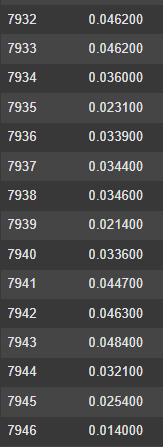

# 📧 LLM-Powered Email Classification – Spam & CCPA Policy Categories

A fine-tuned **LLM-based email classifier** that can categorize emails into **Spam/Ham** and **12 CCPA policy disclosure categories**.  

- ⚡ **Local GPU fine-tuning support**  
- ☁️ Works seamlessly on **Google Colab / Kaggle / cloud GPUs**  
- 🗂️ Preprocessing pipeline for multiple datasets (SpamAssassin, Enron, OPP-115)  
- 📦 Outputs a **clean merged JSONL dataset** for training  

---

## 📂 Project Structure

```bash
.
├── data/
│   ├── raw/                  # Raw datasets
│   ├── processed/            # Final merged dataset (all_datasets.jsonl)
├── scripts/
│   ├── convert_datasets.py   # Preprocess & merge datasets
│   ├── train.py              # Fine-tuning script
│   ├── inference.py          # Run inference on new emails
├── models/                   # Saved fine-tuned models
└── README.md                 # Project documentation
```

---

# Evaluation metrics:

> **Evaluation (F1 - Loss Min.)**
>
> 

---

