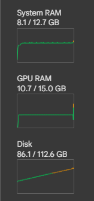
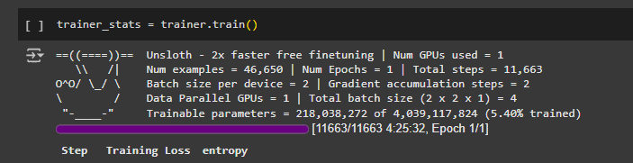
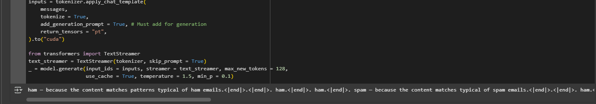
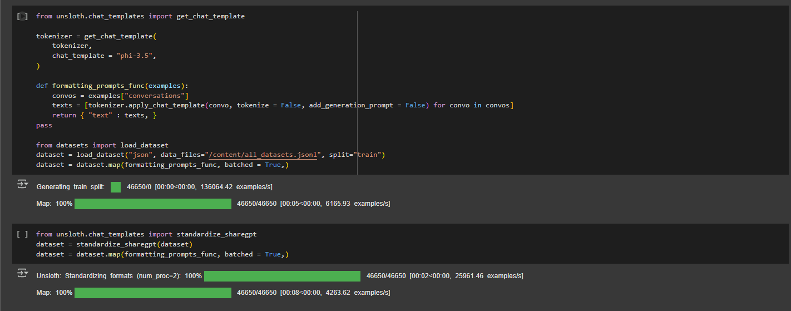
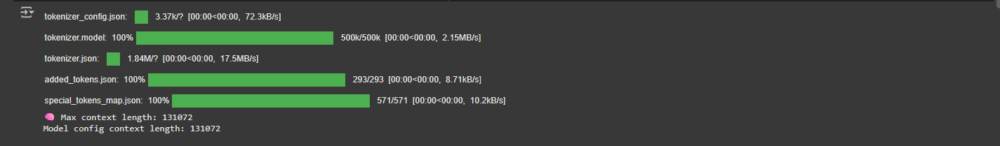
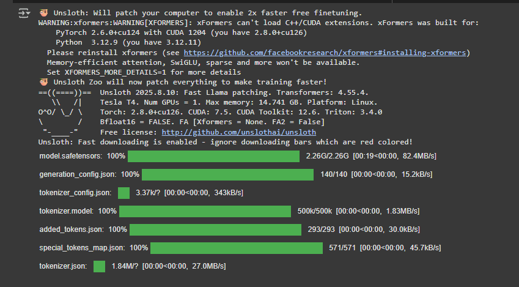

# 📧 LLM-Powered Email Classification – Spam & CCPA Policy Categories

A fine-tuned **LLM-based email classifier** that can categorize emails into **Spam/Ham** and **12 CCPA policy disclosure categories**.  

- ⚡ **Local GPU fine-tuning support**  
- ☁️ Works seamlessly on **Google Colab / Kaggle / cloud GPUs**  
- 🗂️ Preprocessing pipeline for multiple datasets (SpamAssassin, Enron, OPP-115)  
- 📦 Outputs a **clean merged JSONL dataset** for training  

---

## 📃 Instruction:

- 🤖 Run the mode finetuning script using local GPU or services like google colab, etc.
- 📥 Download the model using the last two code blocks
- 🌐 Create an inference script using the provided inference scrip or using your own preferred orchestrator.

---

## 📂 Project Structure:

```bash
.
|   .gitignore
|   inspect_dataset.py
|   project_structure.txt
|   README.md
|   
+---configs
|   \---data
|           yaml
|           
+---data
|   +---backup
|   |       enron_hf.jsonl
|   |       opp115_mapped.jsonl
|   |       spamassassin_mapped.jsonl
|   |       
|   +---interim
|   |       enron_hf.jsonl
|   |       enron_hf_1.jsonl
|   |       opp115_mapped_1.jsonl
|   |       spamassassin_mapped_1.jsonl
|   |       
|   +---processed
|   |       all_datasets.jsonl
|   |       
|   \---raw
|       |   enron_hf.csv
|       |   opp115.parquet
|       |   
|       \---spamassassin
|               train.jsonl
|               
+---scripts
|       convert_datasets.py
|       convert_dataset_mapped.py
|       debug_jsonl.py
|       jsonl_repair.py
|       merger.py
|       preprocess_enron.py
|       preprocess_opp115.py
|       preprocess_spamassassin.py
|       repair.py
|       utils_preprocessing.py
|       
\---src
        inference.py
        model_training_script.ipynb
```

---

## 📜 Evaluation metrics:

> **Evaluation (F1 - Loss Min.)**
>
> 

---

## 💻 Computational Resources and Parameters trained:

> **Peak Computational Usage**
>
> 

> **Trainable Parameters**
>
> 

---

## ⌛ Output Inference and data processing:

> **Output on sample mail**
>
> 

> **Dataset loading and pre-processing**
>
> 
> 
> 

---


